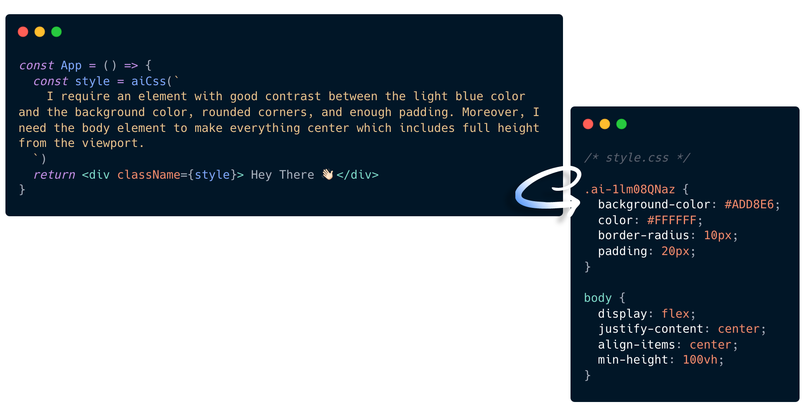

## babel-ai-style-plugin

This plugin is just an experimental and funny experience for me. and it won't be a real babel plugin.


## What's going to happen

find these kinda styles from any js file and replace with nothing then turns it into a css file by chatGPT API.



``` jsx
const App = () => {
  const style = aiCss(`
    an element with good contrast of light blue
  `)
  return <div className={style}>Hey There 👋🏻</div>
}

```


